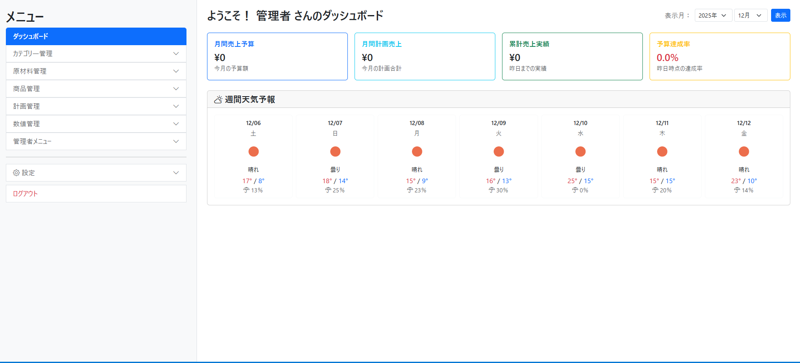
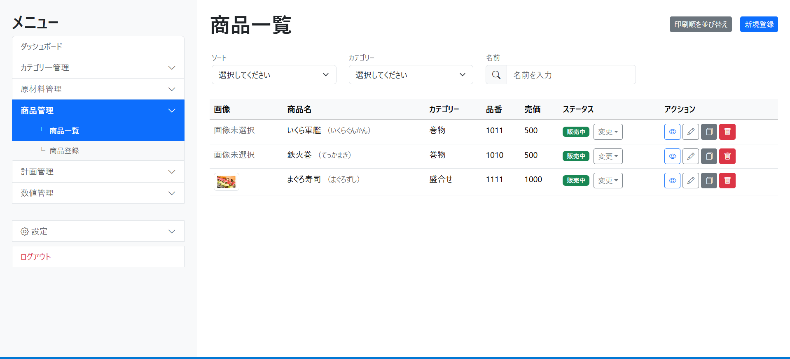
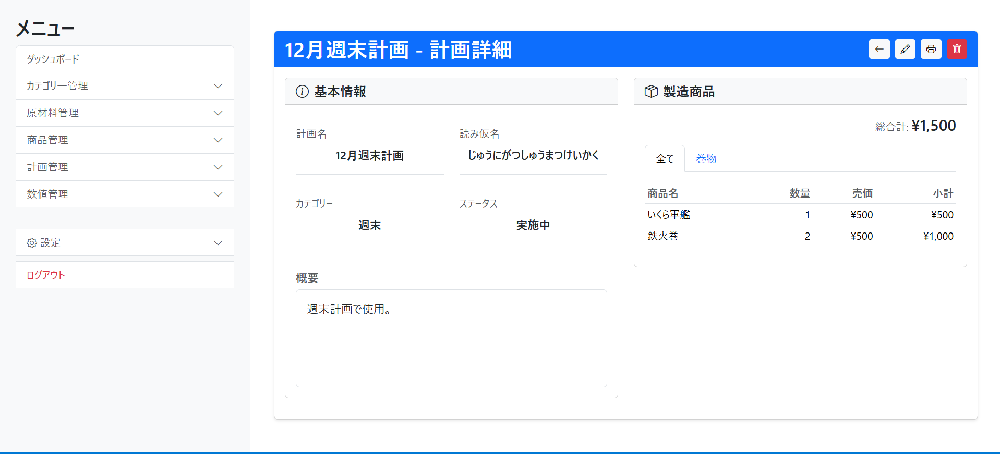
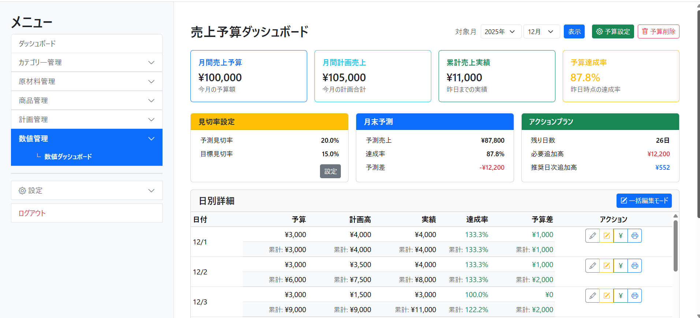
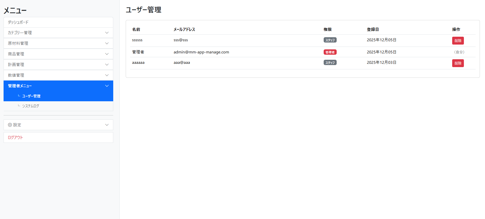
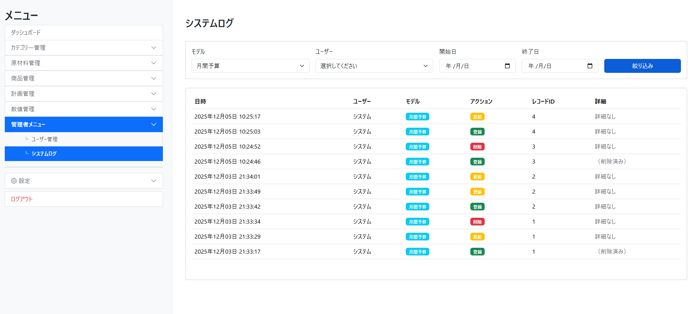

# 製造計画自動計算アプリケーション（MM-App）

## デモ・テストアカウント

**本番環境URL:**
[https://www.mm-app-system.com/](https://www.mm-app-system.com/)

### システム管理者（ポートフォリオ閲覧用）
- **会社コード:** `system-admin`
- Email: `admin@mm-app-manage.com`
- Password: `Portfolio2026!`
- 権限: super_admin（全ポートフォリオのデータを閲覧・管理可能）
- 用途: 採用担当者向けデモアカウント

### 魚屋の寿司株式会社
**会社コード:** `uoya-sushi`
**招待コード:** `MAIN2026`

- **会社管理者**
  - Email: `company-admin@uoya-sushi.test`
  - Password: `Test2026!`
- **店舗管理者**
  - Email: `store-admin@uoya-sushi.test`
  - Password: `Test2026!`
- **一般スタッフ**
  - Email: `staff@uoya-sushi.test`
  - Password: `Test2026!`

### ほっと総菜株式会社
**会社コード:** `hot-sozai`
**招待コード:** `SOZAI2026`

- **会社管理者**
  - Email: `company-admin@hot-sozai.test`
  - Password: `Test2026!`
- **店舗管理者**
  - Email: `store-admin@hot-sozai.test`
  - Password: `Test2026!`
- **一般スタッフ**
  - Email: `staff@hot-sozai.test`
  - Password: `Test2026!`

**テスト環境の仕様:**
- デモ環境では、2つのテストポートフォリオが用意されています
- 各会社は独立したデータを持ち、他社のデータにはアクセスできません
- システム管理者は全ポートフォリオにアクセス可能
- 各ポートフォリオで、会社管理者・店舗管理者・一般スタッフの3つの権限レベルを体験できます

## サービス概要

小売業・飲食業向けの仕込数・発注数自動計算アプリケーションです。

製造計画に基づいて、商品で使用する原材料数を自動計算し、発注数まで出力します。商品や原材料の仕様変更も、ユーザー自身で簡単に変更できるため、継続的に使用できます。

### マルチテナント対応

**このシステムは、会社・店舗単位でデータを分離管理します。**

- 各会社が独立したデータを持つ
- 会社ごとに複数の店舗を管理可能
- 店舗ごとに招待コードで新規登録を制限
- 他社・他店舗のデータは完全に分離
- 会社コード（slug）による識別

### 解決する課題
- Excelでの仕様変更に時間がかかる
- 仕様変更のたびに複雑な数式を修正
- 変更が難しく責任者しか使えない（属人化）

### 得られる価値
- 仕様変更が15分から5分に短縮
- 仕様変更が1箇所の修正だけで完了
- パートさんでも簡単に使える

## このサービスへの思い・作りたい理由

前職で小売業の責任者として、毎週、製造計画をExcelで作成していました。

製造数に応じた仕込数・発注数は自動表示されていましたが、商品仕様が変更される度に式を修正する作業が発生し、非常に時間がかかっていました。また式が複雑で、自分以外のパートさんは活用できていませんでした。

退職後、他社の小売店や飲食店でも同じ課題が発生しているのではないか？と考え、各企業で日雇いのアルバイトをしてヒアリングしたところ、やはり同じ課題が発生していていました。そこで、その課題を解決するべく「誰でも、簡単に、効率よく」運用できる発注数自動計算アプリケーションを作りたいと考えました。

## 主な機能

### 会社・店舗管理
- 会社登録・編集
- 会社一覧表示
- 会社コード（slug）による識別
- 店舗登録・編集・削除
- 店舗一覧表示
- 招待コードによる新規登録制限
- 管理者権限リクエスト機能
- リクエスト承認・却下

### ユーザー管理
- ユーザー登録・ログイン（Devise）
- 管理者権限管理
- ユーザー一覧・削除（管理者のみ）
- 操作履歴の記録（PaperTrail）

### 商品管理
- 商品登録・編集・削除
- 商品一覧表示
- 商品詳細表示
- 商品コピー機能
- 商品並び替え（ドラッグ&ドロップ）
- 商品画像アップロード
- 商品ステータス管理（下書き/販売中/販売終了）
- 商品原材料の構成管理
- カテゴリ別絞り込み

### 原材料管理
- 原材料登録・編集・削除
- 原材料一覧表示
- 原材料詳細表示
- 原材料コピー機能
- 原材料並び替え（ドラッグ&ドロップ）
- 重量ベース/個数ベースの計量方式切り替え
- 発注グループ設定
- 発注単位・製造単位・使用単位の管理
- カテゴリ別絞り込み

### カテゴリ管理
- カテゴリ登録・編集・削除（商品用/原材料用/計画用）
- カテゴリ一覧表示
- カテゴリコピー機能

### 単位管理
- 単位登録・編集・削除（製造単位/発注単位/使用単位）
- 単位一覧表示
- 単位コピー機能
- 単位カテゴリ別管理

### 発注グループ管理
- 発注グループ登録・編集・削除
- 発注グループ一覧表示
- 発注グループコピー機能
- 原材料のグループ化管理

### 計画管理
- 計画登録・編集・削除
- 計画一覧表示
- 計画詳細表示
- 計画コピー機能
- 計画ステータス管理（下書き/実施中/完了）
- 計画に商品を複数登録
- 原材料使用量の自動計算
- 発注数の自動計算
- 予定売上額の自動計算
- 計画印刷機能
- カテゴリ別絞り込み

### 数値管理
- 月次予算登録・編集・削除
- 月次予算の見切り率設定（目標/予測）
- 日次目標登録・編集
- 日次売上実績入力
- 計画スケジュール登録・編集・削除
- 計画スケジュールの実績売上入力
- 予算達成率の自動計算
- 予算差異の自動計算
- 必要追加売上額の自動計算
- 1日あたり必要追加売上額の自動計算
- 一括更新機能

### その他機能
- データ変更履歴の記録（PaperTrail）
- 名前検索機能
- ページネーション（Kaminari）
- レスポンシブデザイン
- ダッシュボード
- 設定画面
- ヘルプ画面（動画モーダル、ピクチャーインピクチャー機能）
- お問い合わせ機能（SendGrid メール送信）

## 使用技術

### バックエンド
- Ruby 3.3.6
- Ruby on Rails 8.1.1
- PostgreSQL

### フロントエンド
- Hotwire（Turbo + Stimulus）
- Bootstrap 5
- SortableJS（ドラッグ&ドロップ）
- Importmap

### インフラ
- Render（デプロイ先）
- Solid Cache（キャッシュ）
- Solid Queue（ジョブキュー）
- Solid Cable（WebSocket）

### 認証
- Devise 4.9

### 主要Gem
- paper_trail 17.0 - データ変更履歴の記録
- kaminari 1.2.2 - ページネーション
- cocoon - 動的フォームの入れ子管理
- enum_help - enumの日本語化
- image_processing 1.2 - 画像処理
- rails-i18n - 国際化対応

### 開発・テスト環境
- RSpec 8.0.2 - テストフレームワーク
- FactoryBot - テストデータ生成
- Faker - ダミーデータ生成
- Capybara - 統合テスト
- Selenium WebDriver - ブラウザテスト
- SimpleCov - テストカバレッジ測定
- Rubocop - コード品質管理
- Brakeman - セキュリティ検査
- Bullet - N+1クエリ検出

## ER図


### 主要テーブル

**会社・店舗管理:**
- companies - 会社情報（マルチテナント対応）
- stores - 店舗情報
- users - ユーザー情報
- admin_requests - 管理者権限リクエスト
- application_requests - 新規申請リクエスト

**リソース管理:**
- categories - カテゴリマスタ（商品/原材料/計画用）
- units - 単位マスタ（製造/発注/使用単位）
- material_order_groups - 発注グループ
- materials - 原材料マスタ
- products - 商品マスタ
- product_materials - 商品と原材料の中間テーブル（N:M）

**計画管理:**
- plans - 製造計画
- plan_products - 計画と商品の中間テーブル（N:M）
- plan_schedules - 日別スケジュール（JSONB スナップショット機能）

**数値管理:**
- monthly_budgets - 月次予算
- daily_targets - 日次目標

**システム:**
- active_storage_blobs - ファイル本体情報
- active_storage_attachments - ファイル紐付け
- active_storage_variant_records - 画像バリアント
- versions - データ変更履歴（PaperTrail）

## 画面遷移図

[Figma: 画面遷移図](https://www.figma.com/design/tK57COTX5tKjmMFua3M6uC/%E7%94%BB%E9%9D%A2%E9%81%B7%E7%A7%BB%E5%9B%B3--Community-?node-id=0-1&t=8R1ZXHCYrR3qE0AM-1)

## スクリーンショット

### ダッシュボード

*ログイン後のトップ画面。主要機能へのアクセスを集約*

### 商品一覧

*商品マスタ管理画面。ドラッグ&ドロップでの並び替え、コピー機能を実装*

### 計画詳細

*製造計画の詳細画面。商品選択により原材料使用量・発注数を自動計算*

### 数値管理

*月次予算と日次目標の管理画面。アクションプラン機能で必要追加売上額を表示*

### 管理者画面（ユーザー管理）

*管理者専用のユーザー管理画面。権限による機能制限を実装*

### システムログ

*システム管理画面。全ユーザーの操作履歴を記録・確認*

## 工夫した点・アピールポイント

### 1. 複雑な計算ロジックの実装

#### 原材料使用量の計算
商品ごとの製造数から、原材料の総使用量を算出します。

**計算式:**
原材料の総使用重量 = 原材料の総使用量 × 原材料の単位重量 発注必要数 = 原材料の総使用重量 / 原材料の発注単位の量


**例:**
- 原材料データ: 「まぐろ」1枚12g、1発注単位1000g
- 総使用量: まぐろ80枚
- 計算: 80枚 × 12g = 960g → 960g ÷ 1000g = 0.96パック（切り上げで1発注）

#### 発注数の自動計算（個数ベース）
個数から発注数を計算します。

**計算式:**
発注必要数 = 原材料の総使用個数 / 1発注単位あたりの個数


**例:**
- 原材料データ: 「シャリ」1発注単位100個入り
- 総使用量: シャリ80個
- 計算: 80個 ÷ 100個 = 0.8袋（切り上げで1発注）

### 2. 数値管理機能（予算・実績管理とアクションプラン）

#### 月次予算・日次目標の管理
- 月次予算の設定（目標売上額、見切り率）
- 日次目標の自動計算・手動調整
- 実績売上の入力・追跡

#### 予算達成率の自動計算
**計算式:**
予算達成率 = (実績売上 / 予算目標) × 100 予算差異 = 実績売上 - 予算目標


#### アクションプラン機能
予算未達時に「残り日数で目標達成するために必要な追加売上額」を自動計算します。

**計算式:**
必要追加売上額 = 予算目標 - 現在の実績売上 1日あたり必要追加売上額 = 必要追加売上額 / 残り営業日数


**例:**
- 月次予算: 1,000,000円
- 現在の実績売上: 600,000円（20日経過）
- 残り営業日数: 10日
- 計算:
  - 必要追加売上額 = 1,000,000円 - 600,000円 = 400,000円
  - 1日あたり必要追加売上額 = 400,000円 ÷ 10日 = 40,000円/日

**活用シーン:**
- 月末に向けた売上目標の見える化
- 日々の販売目標の明確化
- スタッフへの具体的な行動指示

### 3. データ変更履歴の記録（PaperTrail）
- 仕様変更の履歴を自動記録
- 誰が、いつ、何を変更したか追跡可能
- 過去のバージョンに復元可能
- データ改ざん防止と監査証跡の確保

### 4. ユーザビリティの追求
- タブレット・スマホ対応（Bootstrap 5 レスポンシブデザイン）
- 直感的なUI設計（誰でも使える操作性）
- リアルタイム計算結果の表示（Hotwire/Turbo）
- ドラッグ&ドロップでの並び替え（SortableJS + Stimulus）
- コピー機能による効率的なデータ入力

### 5. 堅牢なバリデーション
- **DB層とアプリケーション層の二重防御**
  - データベース: 複合ユニーク制約（`name + category_id`、`reading + category_id`）
  - Rails モデル: `validates :reading, uniqueness: { scope: :category_id }`
- 重複データの自動除外
- 不正データの登録を防止

### 6. コピー機能による効率化
- 商品、原材料、計画、カテゴリ、単位のコピー機能
- 一意制約を考慮した自動リネーム（例: `商品A` → `商品A(コピー)` → `商品A(コピー2)`）
- 関連データも含めた完全コピー（商品コピー時に原材料構成も複製）
- 既存データを元にした新規登録の手間を大幅削減

### 7. N+1問題の解決とパフォーマンス最適化
- **includes/preload/eager_load の適切な使い分け**
  - 一覧表示: `Product.includes(:category, :product_materials)`
  - 計画詳細: `Plan.includes(plan_products: [:product, product_materials: :material])`
  - データベースクエリ数を削減し、パフォーマンスを最適化
  - ページネーション（Kaminari）による大量データ対応

### 8. セキュリティ対策
- **Devise による認証・認可**
  - パスワードハッシュ化（bcrypt）
  - CSRF 対策（Rails デフォルト機能）
- **SendGrid による安全なメール送信**
  - API キー認証
  - Single Sender Verification（送信者認証）
  - TLS 暗号化通信
  - 環境変数による機密情報管理
- **招待コード制による新規登録制限**
  - 環境変数で管理された招待コードによる認証
  - 店舗関係者のみがアカウント登録可能
- **環境変数による機密情報管理**
  - `.env.example` による設定ガイド
  - API キー、パスワード、トークンの安全な管理
- **Strong Parameters によるマスアサインメント対策**
- **管理者権限の実装**（`role` enum による権限分離）
- **Brakeman によるセキュリティ診断**（開発環境）

### 9. 日別スケジュール管理の高度な実装
- **JSONB を活用したスナップショット機能**
  - `plan_schedules.plan_products_snapshot` に計画時点の商品情報を保存
  - 商品マスタ変更後も過去の計画データを正確に保持
- **日別の販売数調整機能**
  - 曜日や天候による販売予測の微調整に対応
  - 計画全体のコピーではなく、日別の柔軟な管理を実現

### 10. 印刷機能の実装
- **CSS メディアクエリによる印刷最適化**
  - 画面表示と印刷レイアウトの切り替え
  - 不要な要素（ナビゲーション、ボタン）の非表示
- **発注書・計画書の自動生成**
  - ブラウザの印刷機能から直接PDF出力
  - 用紙サイズに合わせたレイアウト調整

### 11. 読み仮名（reading）の実装とソート機能
- **カテゴリスコープでのユニーク制約**
  - 同一カテゴリ内で `reading` の重複を防止
  - 異なるカテゴリでは同じ `reading` を許容
- **あいうえお順のソート機能**
  - 漢字の商品名でも正確にソート可能
  - ユーザーが探しやすい並び順を実現

### 12. ヘルプ機能とピクチャーインピクチャー
- **動画モーダルによる操作ガイド**
  - ヘルプページに動画チュートリアルを実装
  - モーダル表示で画面遷移なしに視聴可能
- **ピクチャーインピクチャー機能**
  - 動画を小窓で表示し、他のページを操作しながら視聴可能
  - 作業しながら操作説明を確認できる
  - 実装: Stimulus Controller（`video_modal_controller.js`）

### 13. マルチテナント対応（会社・店舗管理）
- **会社単位でのデータ分離**
  - 各会社（company）が独立したデータを持つ
  - `slug` による会社識別（URL: https://www.mm-app-system.com/c/your-company）
  - 会社ごとに複数の店舗（stores）を管理可能
- **店舗単位でのデータ管理**
  - 各店舗が独立した商品、原材料、計画を持つ
  - 店舗コード（`code`）による一意識別
  - 店舗ごとの招待コード（`invitation_code`）による新規登録制限
- **管理者権限リクエスト機能**
  - ユーザーが店舗管理者権限をリクエスト可能
  - スーパー管理者が承認・却下を管理
  - リクエスト履歴の記録（admin_requests テーブル）
- **セキュリティ**
  - 会社・店舗をまたいだデータアクセスを完全防止
  - 各モデルに `company_id` / `store_id` を付与
  - スコープによる自動フィルタリング

## 開発環境セットアップ

### 必要な環境
- Ruby 3.3.6
- Ruby on Rails 8.1.1
- PostgreSQL 16
- Node.js 22.19.0
- Yarn 1.22.22

### セットアップ手順

```bash
# リポジトリをクローン
git clone https://github.com/yudai-kawajiri/mm-app.git
cd mm-app

# 依存関係をインストール
bundle install
yarn install

# データベース作成・マイグレーション
rails db:create
rails db:migrate

# 初期データ投入（システム管理者 + 2つのテストポートフォリオ作成）
rails db:seed

# 以下のデータが作成されます:
# - システム管理者（super_admin 権限）
# - 魚屋の寿司株式会社（会社コード: uoya-sushi, 招待コード: MAIN2026）
#   - 会社管理者・店舗管理者・一般スタッフ
#   - カテゴリ・単位・原材料・商品・プラン・予算・目標データ
# - ほっと総菜株式会社（会社コード: hot-sozai, 招待コード: SOZAI2026）
#   - 同様の構成でデータを作成

# サーバー起動
rails server
ブラウザで http://localhost:3000 にアクセス
```

**ローカル開発用アカウント:**
- システム管理者: `admin@mm-app-manage.com` / `Portfolio2026!`
- 魚屋の寿司 会社管理者: `company-admin@uoya-sushi.test` / `Test2026!`
- ほっと総菜 会社管理者: `company-admin@hot-sozai.test` / `Test2026!`

## 今後の実装予定

- 在庫管理機能
- AIによる需要予測

## 開発期間

2025年9月 - 2026年1月（約4ヶ月）

## テスト・カバレッジ状況

- **テスト結果:** 637 examples, 0 failures, 21 pending
- **RuboCop:** 344 files inspected, no offenses detected
- **カバレッジ:** 62.68% (2031 / 3238)

## ライセンス

MIT License

## 作成者

- GitHub: [@yudai-kawajiri](https://github.com/yudai-kawajiri)
- GitHub: [https://github.com/yudai-kawajiri/mm-app](https://github.com/yudai-kawajiri/mm-app)
- 本番環境: [https://www.mm-app-system.com](https://www.mm-app-system.com)
